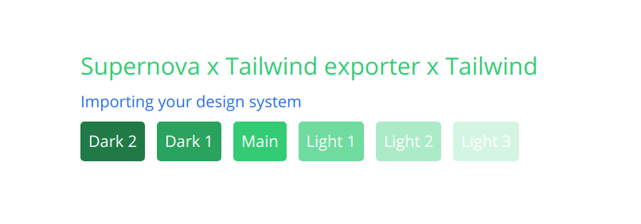

[Supernova](https://supernova.io) is a design system platform that allows you to seamlessly translate your design system data to production-ready code. Supernova works with any platform or tech stack, is used by many developers and organizations around the world, and can help you save time by replacing manual and repetitive tasks that all developers hate. To learn everything Supernova, please check out our [developer documentation](https://developers.supernova.io/).


# Tailwind Exporter


This Tailwind exporter is an extension to the CSS exporter. It generates an additional file, `tailwind-variables.js` that contains the css variables as a `js` object, in order to import them directly into your **Tailwind config**.

## How to import your variables into your Tailwind config - Example :

Here is a project architecture example :

```bash
# Project architecture example

app
├── styles
│   └── designsystem # Output folder of the exporter
│       ├── colors.css
│       ├── # Other
│       ├── # css
│       ├── # files...
│       └── tailwind-variables.js
└── tailwind.config.js
```

The idea is to import `tailwind-variables.js` in `tailwind.config.js`

```css
/* File: styles/designsystem/colors.css */
/* This file is automatically generated by the tailwind exporter */

:root {  
    --color-primary-dark2: #1c7a44;
    --color-primary-dark1: #25a35a;
    --color-primary-main: #2ecc71;
    --color-primary-light1: #6ddb9c;
    --color-primary-light2: #abebc6;
    --color-primary-light3: #d5f5e3;
    --color-primary-border: #29b866;
    --color-secondary-dark2: #0e4290;
    --color-secondary-dark1: #1358c0;
    --color-secondary-main: #186ef0;
    --color-secondary-light1: #5d9af5;
    --color-secondary-light2: #a3c5f9;
    --color-secondary-light3: #d1e2fc;
    --color-secondary-border: #1663d8;
}
```

```js
// styles/designsystem/tailwind-variables.js
// This file is automatically generated by the tailwind exporter

module.exports = {
    'colors': {
        'primary': {
            'dark2': 'var(--color-primary-dark2)', 
            'dark1': 'var(--color-primary-dark1)', 
            'DEFAULT': 'var(--color-primary-main)', 
            'light1': 'var(--color-primary-light1)', 
            'light2': 'var(--color-primary-light2)', 
            'light3': 'var(--color-primary-light3)', 
            'border': 'var(--color-primary-border)', 
        },
        'secondary': {
            'border': 'var(--color-secondary-border)', 
            'dark2': 'var(--color-secondary-dark2)', 
            'dark1': 'var(--color-secondary-dark1)', 
            'DEFAULT': 'var(--color-secondary-main)', 
            'light1': 'var(--color-secondary-light1)', 
            'light2': 'var(--color-secondary-light2)', 
            'light3': 'var(--color-secondary-light3)', 
        },
    }
}
```

```js
// tailwind.config.js

const designSystemVariables = require('./styles/designsystem/tailwind-variables'); // Add this line

module.exports = {
    purge: [],
    darkMode: false,
    theme: {
        extend: designSystemVariables, // Add this line
    },
    variants: {
        extend: {},
    },
    plugins: [],
}
```

That's it ! You can now use the **Tailwind variables** in your templates :

```html
<section class="container mx-auto mt-24">

    <h1 class="text-2xl text-primary">Supernova x Tailwind exporter x Tailwind</h1>
    <p class="text-secondary mt-2">Importing your design system</p>
    <ul class="flex mt-2 text-white">
        <li class="p-2 mr-3 rounded bg-primary-dark2">Dark 2</li>
        <li class="p-2 mr-3 rounded bg-primary-dark1">Dark 1</li>
        <li class="p-2 mr-3 rounded bg-primary">Main</li>
        <li class="p-2 mr-3 rounded bg-primary-light1">Light 1</li>
        <li class="p-2 mr-3 rounded bg-primary-light2">Light 2</li>
        <li class="p-2 mr-3 rounded bg-primary-light3">Light 3</li>
    </ul>

</section>
```



Tokens supported for tailwind exporter :

- [x] Color definitions
- [ ] Text Styles
- [ ] Gradients
- [ ] Shadows
- [ ] Borders
- [ ] Radii
- [ ] Measures

---

The CSS allows you to **produce a CSS definitions** in such a way that it can be immediately used in your production codebase to style all your visual elements. Specifically, this exporter is capable of exporting the previews of:

- [x] Color definitions
- [x] Text Styles
- [x] Gradients
- [x] Shadows
- [x] Borders
- [x] Radii
- [x] Measures

You can generate all production ready-code either manually using Supernova's [VS Code extension](https://marketplace.visualstudio.com/items?itemName=SupernovaIO.pulsar-vsc-extension), or automate your code delivery pipeline using Supernova [Design Continuous Delivery](https://supernova.io/automated-code-delivery).


## Example Usage

Once you have run the exporter against your design system, you can start using the code in your codebase right away. To use the output of the exporter, simply add the stylesheets to your html page, like this:

```
<!DOCTYPE html>
<html>
 <head>
  <meta charset="utf-8">
  <title>Style import test</title>
  <style>
    @import ".build/index.css";
  </style>
 </head>
</html>
```

Because tokens are defined as css variables, you can use them as such, anywhere you need that value (even in order definitions):

```
<p style="color: var(--colorContrast)">...</p>
```

## Installing

In order to make the Supernova CSS exporter available for your organization so you can start generating code from your design system, please follow the installation guide in our [developer documentation](https://developers.supernova.io/using-exporters/installing-exporters).

## Reporting Bugs or Requesting Features

In order to faciliate easy communication and speed up delivery of fixes and features for this exporter, we require everyone to log all issues and feature requests through the issue tracking of this repository. 

Please read through the [existing issues](../../issues) before you open a new issue! It might be that we have already discussed it before. If you are sure your request wasn't mentioned just yet, proceed to [open a new issue](../../issues) and fill in the required information. Thank you!

## Contributing

If you have an idea for improving this exporter package or want a specific issue fixed quickly, we would love to see you contribute to its development! 

There are multiple ways you can contribute, so we have written a [contribution guide](https://developers.supernova.io/building-exporters/contribution-and-requests) that will walk your through the process. Any pull requests to this repository are very welcome.

## License

This exporter is distributed under the [MIT license](./LICENSE.md). [We absolutely encourage you](https://developers.supernova.io/building-exporters/cloning-exporters) to clone it and modify it for your purposes, so it fits the requirements of your stack. If you see that you have created something amazing in the process that others would benefit from, we strongly recommend you consider [publishing it back to the community](https://developers.supernova.io/building-exporters/sharing-exporters-with-others) as well.

## Useful Links

- To learn more about Supernova, [go visit our website](https://supernova.io)
- To join our community of fellow developers where we try to push what is possible with design systems and code automation, join our [community discord](https://community.supernova.io)
- To understand everything you can do with Supernova and how much time and resources it can save you, go read our [product documentation](https://learn.supernova.io/)
- Finally, to learn everything about what exporters are and how you can integrate with your codebase, go read our [developer documentation](https://developers.supernova.io/)

## Other Supernova Exporters

We are developing and maintaining exporters for many major technologies. Here are all the official exporters maintained by Supernova:

- [iOS Exporter](https://github.com/Supernova-Studio/exporter-ios)
- [iOS Localization Exporter](https://github.com/Supernova-Studio/exporter-ios-localization)
- [Android Exporter](https://github.com/Supernova-Studio/exporter-android)
- [React Exporter](https://github.com/Supernova-Studio/exporter-react)
- [Flutter Exporter](https://github.com/Supernova-Studio/exporter-flutter)
- [Angular Exporter](https://github.com/Supernova-Studio/exporter-angular)
- [Typescript Exporter](https://github.com/Supernova-Studio/exporter-typescript)
- [CSS Exporter](https://github.com/Supernova-Studio/exporter-css)
- [LESS Exporter](https://github.com/Supernova-Studio/exporter-less)
- [SCSS Exporter](https://github.com/Supernova-Studio/exporter-scss)


Additionally, we are also developing and maintaining exporters for specific use cases:

- [Style Dictionary Exporter](https://github.com/Supernova-Studio/exporter-style-dictionary)
- [HTML Preview Exporter](https://github.com/Supernova-Studio/exporter-html-preview)

To browse all exporters created by our amazing community, please visit the [Supernova](https://supernova.io) Exporter Store.


